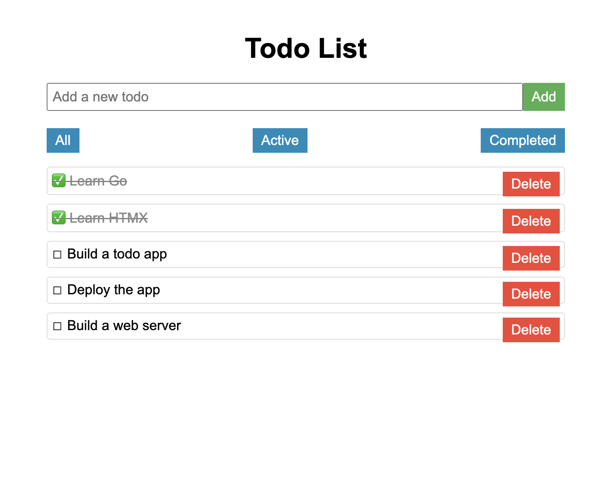

# Go HTMX Todo App

This is a simple Todo application built with Go and HTMX. It demonstrates how to create a dynamic, interactive web application without writing any JavaScript.



## Features

- Add new todos
- Mark todos as complete/incomplete
- Delete todos
- Filter todos (All, Active, Completed)

## Prerequisites

- Go 1.16 or higher

## Getting Started

1. Clone the repository:
   ```
   git clone https://github.com/pahancha/go-htmx-todo.git
   cd go-htmx-todo
   ```

2. Run the application:
   ```
   go run cmd/server/main.go
   ```

3. Open your web browser and navigate to `http://localhost:8080`

## Project Structure

- `cmd/server/main.go`: Entry point of the application
- `internal/handlers/todo_handlers.go`: HTTP handlers for todo operations
- `internal/models/todo.go`: Todo model definition
- `templates/`: HTML templates for the application

## License

This mini  project is open source and under the [MIT License](LICENSE).
